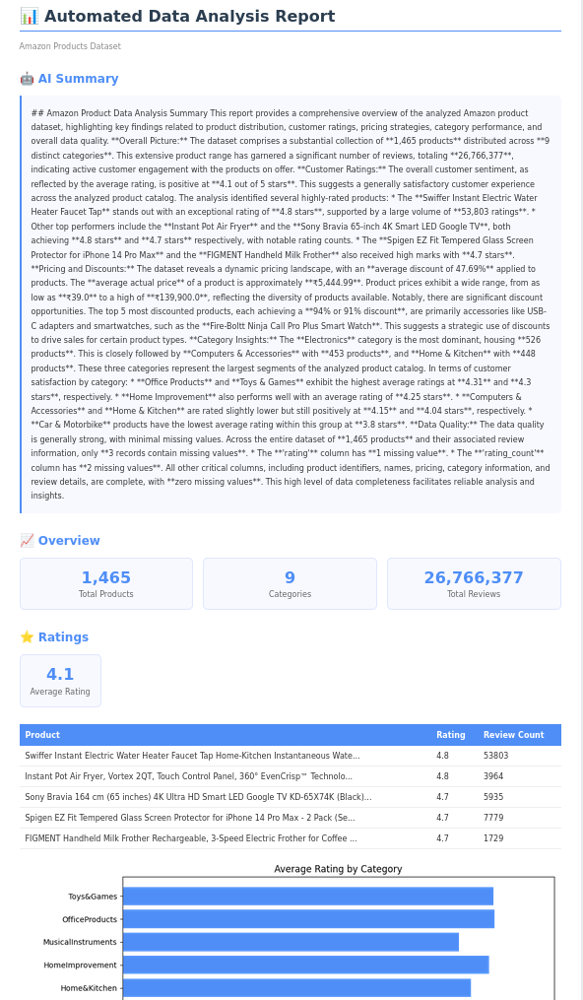

# 📊 Automated Data Analysis Report Generator

A Python tool that automatically analyses any CSV dataset, generates insightful visualisations, and produces an AI-powered plain-English summary — all rendered as a clean, self-contained HTML report.

  

## 🔍 Features

- Automatic statistical analysis using Pandas
- AI-generated plain-English summary via Google Gemini API
- Interactive HTML report with styled tables and charts
- Data quality assessment (missing values, formatting issues)
- Ratings, pricing, discount, and category breakdowns

## 📸 Sample Output



## 🛠️ Tech Stack

- **Python 3.13**
- **Pandas** — data analysis
- **Matplotlib** — chart generation
- **Google Gemini API** — AI summary generation
- **python-dotenv** — secure API key management

## 🚀 Setup Instructions

### 1. Clone the repository
```bash
git clone https://github.com/costaprof/data-analysis-report-generator.git
cd data-analysis-report-generator
```

### 2. Create and activate a virtual environment
```bash
python -m venv .venv
source .venv/bin/activate  # On Windows: .venv\Scripts\activate
```

### 3. Install dependencies
```bash
pip install -r requirements.txt
```

### 4. Set up your API key
Create a `.env` file in the project root:
```
GEMINI_API_KEY=your_gemini_api_key_here
```
Get a free API key at [aistudio.google.com](https://aistudio.google.com)

### 5. Add your dataset
Place any CSV file in the `sample_data/` folder and update the file path in `main.py`:
```python
file_path = "sample_data/your_file.csv"
```

### 6. Run the tool
```bash
python main.py
```

The report will be saved to `output/report.html`. Open it in any browser.

## 📁 Project Structure

```
data-analysis-report-generator/
│
├── main.py                  # Entry point — orchestrates the pipeline
├── analyser.py              # Pandas data analysis logic
├── ai_summary.py            # Google Gemini API integration
├── report_generator.py      # HTML report generation with charts
│
├── sample_data/             # Place your CSV datasets here
├── output/                  # Generated reports saved here
│
├── .env                     # API key (not tracked by Git)
├── requirements.txt
└── README.md
```

